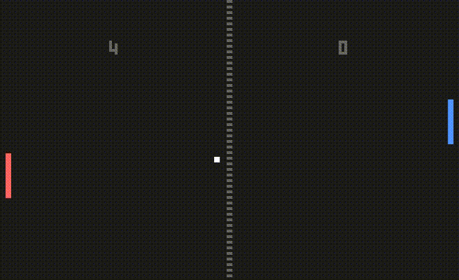
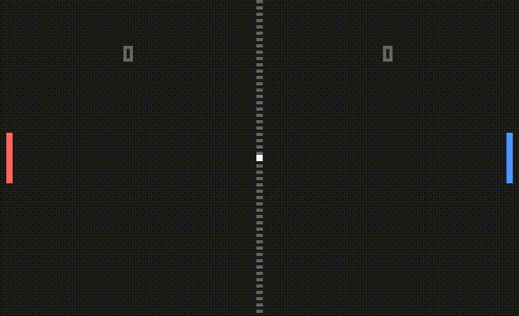

# Pong

A pong game written in C++ with SDL.

Choose to play with a friend or against computer.

Choose to play on multiplayer over the internet.

Have a look to the settings file to see what you can tweak.

## Get started

The following packages are required: `make`, `g++`, `libsdl2-dev`, `libsdl2-ttf-dev` and `libsdl2-image-dev`.

Install the missing packages by executing `sudo apt install 'package-name'` on debian based distro. There is also a Nix flake if you have Nix.

Compile the project by executing `make` in the project directory.
